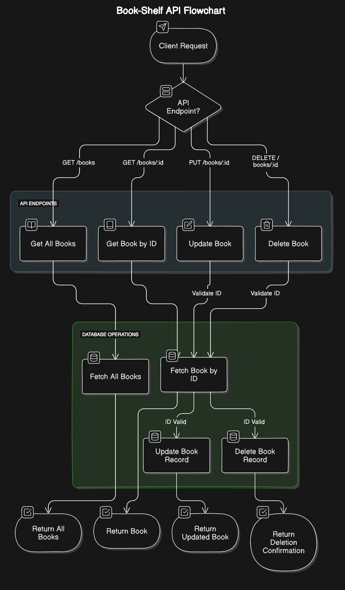
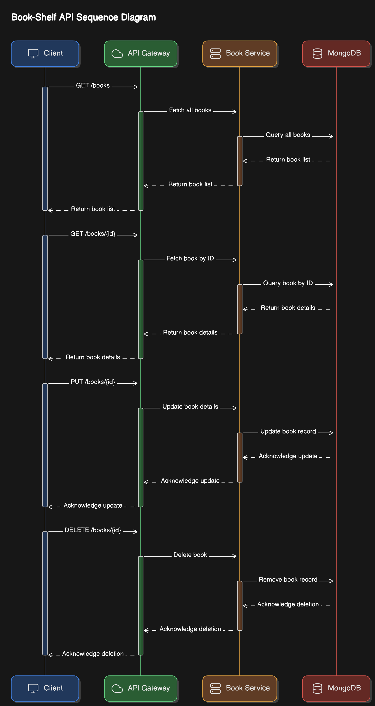

# Book Shelf

Book Shelf is a web application built with Go, using the Gin web framework and MongoDB as the database. It serves as a book library server where users can manage and retrieve information about various books.

## Features

- **Create, Read, Update, Delete (CRUD)**: Manage book records with ease.
- **Search and Filter**: Search for books by title, author, genre, and more.
- **JSON API**: Interact with the book data through a JSON-based API.

## Technologies Used

- **Programming Language**: Go
- **Web Framework**: Gin
- **Database**: MongoDB

## Getting Started

Welcome to Book Shelf! I'm excited to introduce you to our book library server built with Go and powered by Gin framework along with MongoDB. Book Shelf makes it easy to manage and explore information about various books, whether you're a reader, librarian, or developer looking to integrate book data into your application.

## API Endpoints

- **Create a New Book**: `POST /books`
- **Get All Books**: `GET /books`
- **Get a Single Book by ID**: `GET /books/:id`
- **Update a Book**: `PUT /books/:id`
- **Delete a Book**: `DELETE /books/:id`

## Book Model

The book model includes the following fields:

- **ID**: Unique identifier for the book
- **BookID**: Custom identifier for the book
- **Title**: Title of the book
- **Author**: List of authors
- **Language**: Language in which the book is written
- **Publisher**: Publisher of the book
- **PublishingDate**: Date when the book was published
- **Genre**: Genre of the book
- **ISBN**: International Standard Book Number
- **Edition**: Edition of the book
- **Pages**: Number of pages
- **Summary**: Brief summary of the book
- **AboutAuthor**: Information about the author(s)

## Contact

If you have any questions or suggestions, feel free to reach out to me.

---

Thank you for choosing Book Shelf. Happy reading and exploring!
